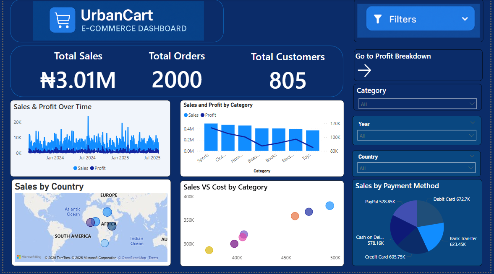
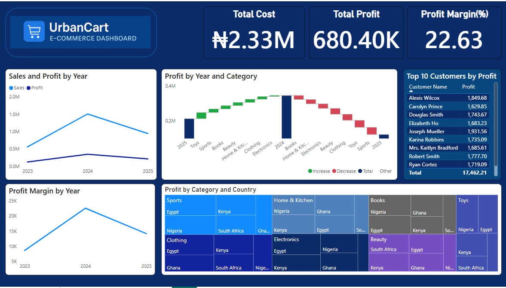

# 🛒 UrbanCart E-Commerce Dashboard (Power BI)

An interactive Power BI dashboard project that analyzes the sales, profit, and performance of an e-commerce business across various countries, product categories, and customers.

---

## 🎯 Objective

To provide decision-makers with a clear view of performance metrics, understand sales and profit trends, identify high-performing categories and customers, and detect potential loss areas all in a single interactive report.

---

## 🧾 Dataset Description

This dataset simulates real-world data for an e-commerce platform, with the following key columns:

| Column           | Description                                                                 |
|------------------|-----------------------------------------------------------------------------|
| `Order Date`     | Date when the order was placed                                              |
| `Customer ID`    | Unique customer identifier                                                  |
| `Customer Name`  | Name of the customer who made the purchase                                  |
| `Product`        | Product title/label                                                         |
| `Category`       | Product category (Beauty, Sports, Home & Kitchen, etc.)                     |
| `Country`        | Country where the order was placed                                          |
| `Sales`          | Revenue generated from the order                                            |
| `Unit Price`     | Price per item                                                              |
| `Quantity`       | Number of units ordered                                                     |
| `Cost`           | Cost of the items ordered                                                   |
| `Profit`         | Profit = Sales - Cost                                                       |
| `Profit Margin`  | Profit margin percentage for each order                                     |
| `Payment method` | Method of payment for each product                                          |

---

## ❓ Business Problem

UrbanCart, a mid-sized e-commerce company, has experienced increasing sales and steady order growth. However, profit remains inconsistent. Management is concerned that high discounting, underperforming regions, or unprofitable products may be responsible.

They need a dashboard that:
- Explores **why profits are dropping** despite rising sales
- Highlights **top and underperforming** products/customers/countries
- Helps make **data-driven decisions** quickly

---

## 🔍 Key Questions Answered

- Why is profit decreasing while sales are increasing?
- Which product categories drive the most profit?
- Are there unprofitable segments dragging overall performance?
- Who are our top customers by profit?
- What is the profit margin trend over the years?
- How do sales and cost relate across categories?
- How are sales and profit distributed across countries?
- Is the business becoming more efficient or losing revenue due to cost?

---

## 📈 Dashboard Pages & Features

### Page 1: Sales Overview
- Total Sales, Orders, and Customers KPIs
- Sales and Profit Trend Over Time
- Sales by Country Map
- Sales by Category
- Payment Method Distribution
- Filter panel (interactive slicers: category, date, customer)

### Page 2: Profit Analysis
- Total Profit and Profit Margin KPIs
- Waterfall Chart showing profit trends by year and category
- Profit Margin Over Time
- Customer Tables (Top 10 by Profit)
- Tree Map: Profit by Category and Country

---

## 🧠 Challenges Faced

- **Discount not found in dataset**: Tried calculating discount from unit price and sales, but most values returned zero — suggesting no discount was recorded.
- **Waterfall Chart Logic**: Initially tried to sort by profit, but only showed red bars. Sorting by year gave better trend visualization.
- **Choosing Customer Ranking**: Struggled between using "Top Customers by Sales" vs. "by Profit" — chose profit to align with the core problem.
- **Page Design**: Unsure whether to use two or three pages. Settled on two for clarity and story flow.
- **Visual Placement**: Faced layout limits, especially when deciding what to remove to make space for valuable visuals like scatter plots.
- **Color Consistency**: Adjusted scatter and tree map visuals to match brand colors.

---

## ⚙️ Tools Used

- Power BI (Visualizations, Filters, Cards, DAX)
- Power Query (Data transformation)
- GitHub (Version control & project sharing)

---

## 🙋🏽‍♀️ Author

**Fatimo Yusuf**  
Data Analyst | Storyteller with Data | Power BI Enthusiast  
📌 [LinkedIn](https://www.linkedin.com/in/fatimo-yusuf-b8b7bb249)  
📌 [GitHub](https://github.com/FatimoYusuf)

---

## 💡 How to Use This Dashboard

1. Download the `.pbix` file from this repo
2. Open in Power BI Desktop
3. Use slicers to interact with the data (e.g., filter by year, country, category)
4. Explore relationships between cost, sales, and profit margins

---

## 📁 Data Source

Dataset structure was simulated using a prompt to ChatGPT and customized for this portfolio project. It does not represent any real company or customer data.

## 📊 Dashboard Previews

### Page 1: Sales Overview

### Page 2: Profit Analysis

